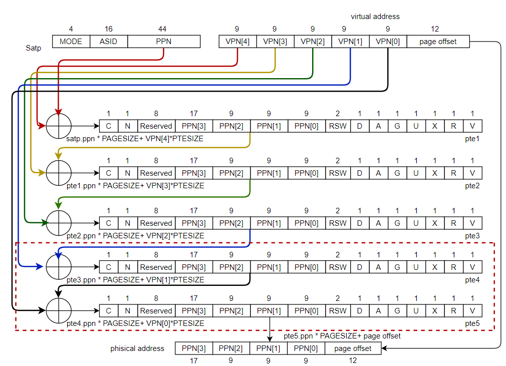

# **Physical back-end evaluation documents**

## 1.DC results

### EmbeddedTLB timing comparison

Compare the results in EmbeddedTLB.timing.inc_2nd.tt_v0p8_85c.rpt

|                      | **Sv39** | Sv57 |
| :------------------: | :------: | :--: |
| **tlbExec to mdTLB** |   0.10   | 0.10 |
|  **reset to mdTLB**  |   0.20   | 0.20 |
|   **mdTLB to reg**   |   0.14   | 0.18 |
|   **mdTLB to in**    |   0.14   | 0.19 |
|    **in to out**     |   0.41   | 0.41 |
|    **reg to reg**    |   0.25   | 0.26 |
|    **in to reg**     |   0.37   | 0.37 |
|    **reg to out**    |   0.29   | 0.30 |

### EmbeddedTLB area comparison

Compare the results in EmbeddedTLB.qor.inc_2nd.tt_v0p8_85c.rpt

|               |  **Sv39**   |  **Sv57**   |
| :-----------: | :---------: | :---------: |
| **Cell Area** | 2645.965444 | 3782.557451 |

### EmbeddedTLB power comparison

Compare the results in EmbeddedTLB.qor.inc_2nd.tt_v0p8_85c.rpt

|                         | **Sv39**  |  **Sv57**  |
| :---------------------: | :-------: | :--------: |
| **Cell Internal Power** | 4.7067 mW | 6.6272 mW  |
| **Net Switching Power** | 4.1499 mW | 4.9988 mW  |
| **Total Dynamic Power** | 8.8567 mW | 11.6260 mW |

## 2.Analysis

#### Timing

The increase in critical paths occurs on the path of MDTLB to REG and MDTLB to IN, from 0.14 to 0.18. Because SV39's PTW process is access to a three-level page table, and the SV57's PTW process is access to a five-level page table. Therefore, the  critical path will become a 5/3-fold.



In the corresponding code, the LEVEL value of the PTW is modified from 3 to 5, so the proportion of the longest path is 3: 5.

#### Area

Since the width of Mask in the code is modified, Masklen is changed from 18 to 52.The width of the physical address is also modified, and the area is modified from 32 to 64, so the area of the TLB has changed.

```scala
//missMask := Mux(level===3.U, 0.U(maskLen.W), Mux(level===2.U, "h3fe00".U(maskLen.W), "h3ffff".U(maskLen.W)))
missMask := Mux(level===5.U, 0.U(maskLen.W), Mux(level===4.U, "hffff8000000".U(maskLen.W), Mux(level===3.U, "hffffffc0000".U(maskLen.W), Mux(level===2.U, "hffffffffe00".U(maskLen.W), "hfffffffffff".U(maskLen.W)))))
```

#### Power consumption

Since the number of layers traversed in the PTW process is modified from 3 to 5, the logic of the relevant judgment needs to be increased. The address width has also changed, and more Mask needs to be handled. Therefore, it can be observed that the value of Cell Internal Power has also changed.

## 3.Summarize

SV57 is mainly divided into two sections of configuration modifications and PTW modifications to Nutshell. Configuration modification mainly performs address width and MASK modification, and PTW modifies the number of traversal layers of the page table from three layers to five layers. These two modifications have an impact on timing, area, and power consumption. However, when actual use, as long as the virtual address accessed can be found in the TLB, there is no need to perform PTW and the TLB miss is relatively small. Therefore, the increase in timing and power consumption does not have a large impact in actual conditions.