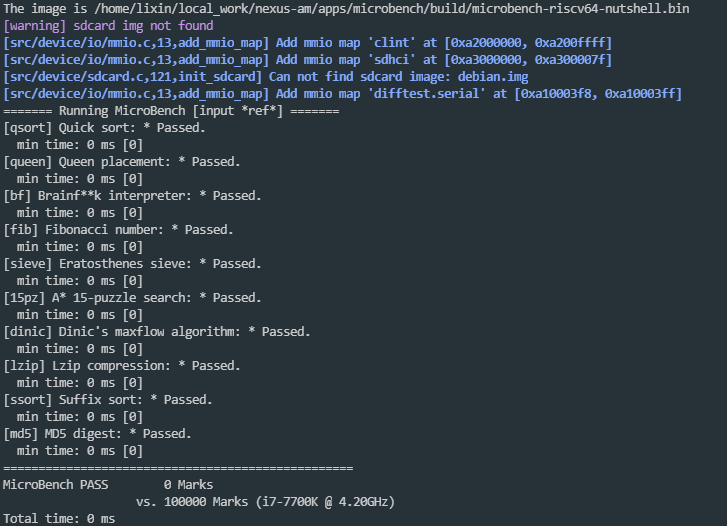
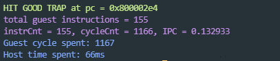

# Functional testing and analysis 

## 1.Test framework 

Our test framework contains a simulator with correct behavior: NEMU, the processor core to be tested: NutShell, the simulated peripheral devices: SDRAM, UART, etc. After NutShell executes an instruction, NutShell will wake up NEMU to execute an instruction, and compare the states of the two, if they are the same then go ahead to execute instructions , otherwise there is an error which will terminate the process, and the error field will be printed. The schematic diagram is as follows:


## 2.Method

- Before starting the test, an initial level 3 page table of Sv39 (this page table translates the virtual address to the same physical address) is populated into the simulated RAM interacting with NutShell.
- Hard-coding set the initial position of the SATP register to point to the page table, and modify the condition for the start of address conversion, so that it can be turned on when it is in M mode. After that, NutShell can directly perform address translation and access the page table when accessing the memory, without requiring the test program to maintain an additional page table, which reduces the difficulty of testing.As long as the test program can be run correctly, the behavior of the MMU is correct.
- In order to add support for the Svnapot extension test, we need to make some modifications to the initial populated page table, change the N bits of the page table entry to 1, and change the PPN\[0][3:0] to 1000, so that all the leaf node page table entries are the page table entries of the Svnapot extension. `src/test/csrc/ram.cpp` is the directory in which this emulated RAM file resides.

First add a parameter to the addPageSv39 function to choose whether or not to use the Svnapot extended PTE
```cpp
void addpageSv39(bool napot_on) {...}
```
For Svnapot extended PTE, set N to 1, PPN\[0][3:0] to 1000
```cpp
for(int outidx = 0; outidx < PTEMMIONUM; outidx++) {
    for(int inidx = 0; inidx < ENTRYNUM; inidx++) {
      if(!napot_on) 
        ptemmio[outidx][inidx] = (((0x40000000 + outidx*PTEVOLUME + inidx*PAGESIZE) & 0xfffff000) >> 2) | 0xf;
      else
        ptemmio[outidx][inidx] = ((((0x40000000 + outidx*PTEVOLUME + inidx*PAGESIZE) & 0xffff0000) | 0x00008000) >> 2) | 0xf | 0x8000000000000000;
    }
 }
for(int outidx = 0; outidx < PTENUM; outidx++ ) {
    for(int inidx = 0; inidx < ENTRYNUM; inidx++ ) {
      if(!napot_on)
        pte[outidx][inidx] = (((0x80000000 + outidx*PTEVOLUME + inidx*PAGESIZE) & 0xfffff000)>>2) | 0xf;
      else 
        pte[outidx][inidx] = ((((0x80000000 + outidx*PTEVOLUME + inidx*PAGESIZE) & 0xffff0000) | 0x00008000) >> 2) | 0xf | 0x8000000000000000;
    }
}
```
Then turn on the Svnapot extension when calling this function
```cpp
//new add
 addpageSv39(true);
//new end
```
## 3.Results
Note: All marks and times in the results are not trusted because the page table does not override the MMIO address of 0x3XXXXXXX, so I annotated the time-related functions in the test program.
### 3.1 CoreMark：
Svnapot enabled：


### 3.2 Dhrystone：
Svnapot enabled：


### 3.3 Microbench(test)：
Svnapot enabled：


### 3.4 Microbench(ref)：

**This Microbench is more complex than the microbench(test)**

Svnapot enabled：




### 3.5 napot test case of riscv-tests：

Svnapot enabled：





## 4.Analysis

- In terms of function, Coremark Dhrystone and Microbench can run to the end correctly, indicating the correctness of function implementation.


