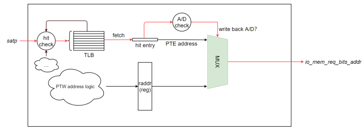
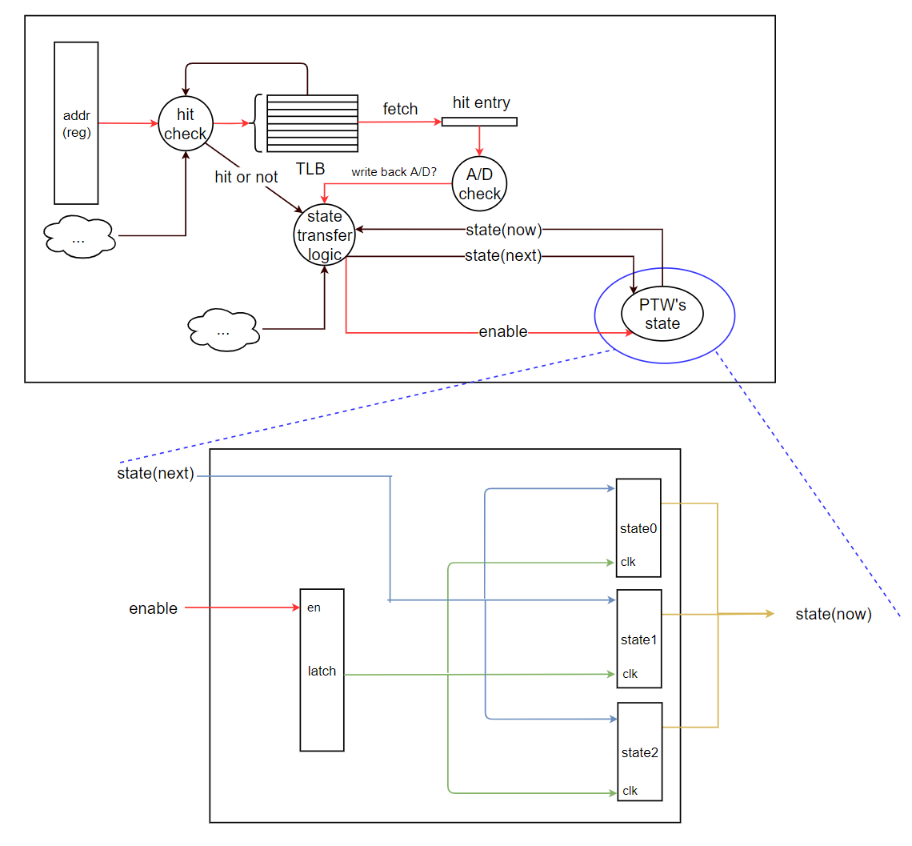
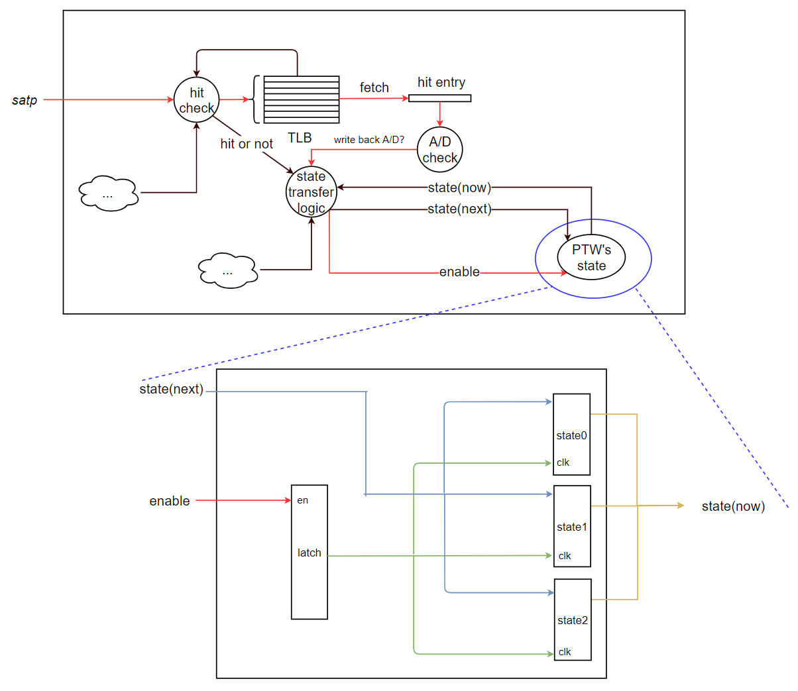
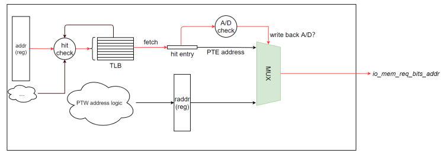

# Physical back-end evaluation

## 1.Theoretical analysis 

There are many ways to implement the Svnapot extension on NutShell, but in the end we use one that has the least amount of code change and the least impact on timing and area.
In terms of timing, the operation of checking whether PTE is Svnapot PTE is added at the last level of PTW. This operation is to take out the N bit of PTE and compare the PPN\[0][3:0] bit of PTE to get a signal. If it is Svnapot PTE, use a new mask.These operations will increase the number of logical layers to obtain the mask, and this increase in selection logic may affect the timing.

```scala
if(napot_on)
	missMask := Mux(level===3.U, 0.U(maskLen.W), Mux(level===2.U, "h3fe00".U(maskLen.W), Mux((memRdata.n && memRdata.ppn(napot_bits-1,0) === napot_patten.U),napot_mask.U(maskLen.W),"h3ffff".U(maskLen.W))))
else
	missMask := Mux(level===3.U, 0.U(maskLen.W), Mux(level===2.U, "h3fe00".U(maskLen.W), "h3ffff".U(maskLen.W)))
```
Another possible timing problem is that when writing back to A/D bits, you need to make an extra check to see if the TLB entry is caching an Svnapot PTE. If so, you need to keep the N bits.
```scala
  //!!! PPN needs to be 44 bit-width 
  val hitPTEStore = RegEnable(Cat(0.U(10.W) , 0.U( (44 - hitData.ppn.getWidth).W ) , hitData.ppn, 0.U(2.W), hitRefillFlag), hitWB)
  val hitNapotPTEStore = if (!napot_on) null else RegEnable(Cat(1.U(1.W),0.U(9.W), 0.U( (44 - hitData.ppn.getWidth).W ) , hitData.ppn, 0.U(2.W), hitRefillFlag), hitWB)
  val hitWBStore =  if(napot_on)
                    Mux(hitMeta.mask === napot_mask.U,hitNapotPTEStore,hitPTEStore)
                  else 
                    hitPTEStore
```
In terms of area, there are only a few more lines and a few more registers, and no new bits are added to the TLB so there is no additional area overhead on the TLB.
In terms of power consumption, there should be an increase, because there is some extra judgment logic.

## 2.DC results
Comparison: Sv39 paging versus Sv39 paging with the Svnapot extension.
### 2.1 timing
In both ITLB and DTLB, the critical path is to determine the TLB hit and take out the hit item for subsequent operation.This is due to the design of NutShell itself. After the extension of Svnapot, the timing of ITLB and DTLB is basically not affected. The A/D bit write back and mask selection that may affect the timing are not located in the critical path.Overall, the difference in timing is only 1 percent, which is negligible.
### 2.2 area
As expected, the total area increased due to the judgment that more connections were needed, but the change was small. The number of sequential logic units of ITLB and DTLB increased by one after adding the extension of Svnapot. The number of combined logic units increased by a large amount and the total area increased by 0.8 percent.
### 2.3 power
As expected, the total power consumption increased due to more judgment logic, but the change was also small, with the total power consumption increasing by 0.4 percent.
## 3.Conclusion
The Svnapot extension is easy to implement on NutShell, with a small amount of work and little influence on the timing area and power consumption.
## 4.Appendix
### 4.1.DTLB analysis report
**Comparison object: Sv39 and Sv39 + Svnapot**

#### 4.1.1 timing
**in-out path group**

- The critical path has not changed

The critical path is CSRSATP to io_mem_req_bits_addr
Specifically, after entering SATP, each TLB table item is judged to be hit in parallel, and the A/D bit of the hit item is selected to observe whether the A/D bit meets the specification. A selection signal of multi-selector is obtained, and the memory access address is obtained after the multi-selector.

**reg-reg path group**

- Logic tier increased from 34 to 36
- Critical path length increased from 0.40 to 0.42

The critical path is u_T_19_addr_reg_52_ to tlbExec/clk_gate_state_reg/latch, and finally to the clock gate of the state register, which is used to generate the clock of the state register for low power processing.
This path determines the hit between the virtual address (REG) input to the TLB to be converted and each entry of the TLB. It takes out the hit item, checks the A/D bit, and changes the state of the PTW if the A/D bit is not set to read or write.The critical path is the same without Svnapot.

**in-reg path group**

- Logic tier increased from 30 to 34
- The critical path length remains the same and is 0.34

The critical path becomes CSRSATP[46] to tlbExec/clk_gate_state_reg/latch, and finally to the clock gate of the state register, which is used to generate the clock of the state register for low power processing.
This path is similar to the Reg-Reg critical path, except that the input signal changes from the register to the IO port. Input the value of SATP to get the ASID bits and compare it with the ASID of each item in TLB to get the hit signal. Take out the hit item and check the A/D bit.If A write/read A/D bit is not set to A pair, the PTW state needs to be changed.The critical path is the same without NAPOT

**reg-out path group**

- The critical path has changed, but the total length remains the same. Instead of u_T_18_addr_reg to io_mem_req_bits_wdata, it is now u_T_18_addr_reg to io_mem_req_bits_addr

The original critical path: the virtual address in the address register for TLB hit judgment, according to the item of hit take out A/D bit to determine whether to write back, according to the signal to select the content of write back
.png)
Now the critical path: the virtual address in the address register to determine the TLB hit, according to the hit item to take out the A/D bit to determine whether the need to write back, according to the signal to select the write back address



#### 4.1.2 area

- Cell count
   - The number of combined logic units increased from 12,991 to 13,360
   - Timing logic units increased from 15783 to 1578
- The area increased slightly from 22990.158626 to 23161.852704
#### 4.1.3 power

- With Svnapot, the power consumption increases slightly
   - Dynamic power consumption increases from 228.0097mW to 228.4406mW
   - The static power consumption increases from 152.7155 UW to 165.2444 UW
### 4.2. ITLB analysis report
**Comparison object: Sv39 and Sv39 + Svnapot**

> The ITLB is special in that it is read-only and does not write, so there is no writing back to  the D bit.Since the PTW of NutShell directly places the A bit when backfilling the PTE to TLB after miss, the A bit in the TLB entry of NutShell is always 1, and there is no writing back to the A bit.So there is no writing back to A/D bits, but NutShell's ITLB and DTLB are instantiated with A single class, and ITLB still allows for writing back to A/D bits.

#### 4.2.1 timing
**in-out path group**

- The critical path has not changed, again from CSRSATP to io_mem_req_bits_addr

The critical path is as follows: after entering SATP, each TLB table item is judged to be hit in parallel, and the A/D bit of the hit item is selected to observe whether the A/D bit meets the specification. A selection signal of multiple selector is obtained, and the access address is obtained after the multiple selector.
**reg-reg path group**

- The critical path has not changed, from u_T_18_addr_reg_35_ to clk_gate_T_0_reg/latch

The critical path is:The access address in the address register and the virtual address in the TLB are taken out for hit judgment, and then the hit check is carried out to get the instruction page fault signal, and the page fault signal is used to determine TLBExec.io.out.ready.
The ready signal is used to determine if TLBexec can still process the request, i.e., TLBexec.io.in. ready. The ready signal is used to determine if the request was accepted by TLBexec.
This is used to control the update of the TLBMD register, which is used to cache information from the TLB. The contents of the TLB are written to the register only when the mdupdate is 1, which is only when a valid fetch request occurs.
The clock gate mechanism is also used for low power processing, and eventually the path ends with latch enabling.
**in-reg path group**

- The critical path has not changed, again from CSRSATP to clk_gate_T_0_reg/latch

This path is similar to the critical path of reg-reg, except that it changes from the register to the IO port, which determines the TLB hit first and eventually returns to mdupdate .
**reg-out path group**

- The critical path has changed

The original critical path: whether the virtual address in the address register and each item of TLB hit, after getting the hit item, check the A/D bit to get the hitWB signal to choose the memory access address.
New critical path: Virtual address in address register: determine TLB hit and perform hit check for instruction page fault. Select io_in_resp_bits_user from TLBexec or from out via instruction page fault signal.

#### 4.2.2 area

- Cell count
   - The number of combined logic units increased from 2724 to 2997
   - Timing logic units increased from 1397 to 1398
- The area increased from 2683.808645 to 2727.198730
#### 4.2.3 power

- The addition of Svnapot increases power consumption slightly
   - Dynamic power consumption increased from 8.9092 mW to 8.9901 mW
   - The static power consumption is increased from 59.1291 UW to 60.8419 UW
### 4.3 details
Detailed documentation is available at [here](https://github.com/RV-VM/DC-Svnapot)
